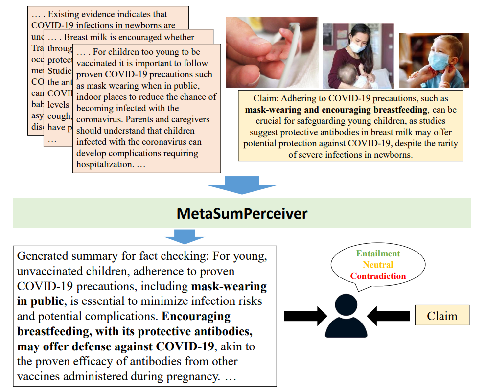

# MetaSumPerceiver  

[paper](https://aclanthology.org/2024.acl-long.474/), [arxiv](https://arxiv.org/abs/2407.13089)  

## MetaSumPerceiver: Multimodal Multi-Document Evidence Summarization for Fact-Checking  

  

## Abstract  

Fact-checking real-world claims often requires reviewing multiple multimodal documents to assess a claim's truthfulness, which is a highly laborious and time-consuming task. In this paper, we present a summarization model designed to generate claim-specific summaries useful for fact-checking from multimodal, multi-document datasets. The model takes inputs in the form of documents, images, and a claim, with the objective of assisting in fact-checking tasks. We introduce a dynamic perceiver-based model that can handle inputs from multiple modalities of arbitrary lengths. To train our model, we leverage a novel reinforcement learning-based entailment objective to generate summaries that provide evidence distinguishing between different truthfulness labels. To assess the efficacy of our approach, we conduct experiments on both an existing benchmark and a new dataset of multi-document claims that we contribute. Our approach outperforms the SOTA approach by 4.6% in the claim verification task on the MOCHEG dataset and demonstrates strong performance on our new Multi-News-Fact-Checking dataset.  

## Dataset  

## Citation 
If you find this project useful in your research, please consider cite:

```
@inproceedings{chen-etal-2024-metasumperceiver,
    title = "{M}eta{S}um{P}erceiver: Multimodal Multi-Document Evidence Summarization for Fact-Checking",
    author = "Chen, Ting-Chih  and
      Tang, Chia-Wei  and
      Thomas, Chris",
    editor = "Ku, Lun-Wei  and
      Martins, Andre  and
      Srikumar, Vivek",
    booktitle = "Proceedings of the 62nd Annual Meeting of the Association for Computational Linguistics (Volume 1: Long Papers)",
    month = aug,
    year = "2024",
    address = "Bangkok, Thailand",
    publisher = "Association for Computational Linguistics",
    url = "https://aclanthology.org/2024.acl-long.474",
    pages = "8742--8757",
    abstract = "Fact-checking real-world claims often requires reviewing multiple multimodal documents in order to assess the claim{'}s truthfulness, a highly laborious and time-consuming task. In this paper, we present a summarization model crafted to generate claim-specific summaries useful for fact-checking from multimodal multi-document datasets. The model takes inputs in the form of documents, images, and a claim, with the objective of assisting in fact-checking tasks. We introduce a dynamic perceiver-based model that is able to handle inputs from multiple modalities of arbitrary lengths. To train our model, we leverage a novel reinforcement learning-based entailment objective in order to generate summaries that provide evidence distinguishing between different truthfulness labels. To assess the efficacy of our approach, we conduct experiments on both an existing benchmark as well as a new dataset of multi-document claims which we contribute. Our approach outperforms the SOTA approach by 4.6{\%} in the claim verification task on the MOCHEG dataset and demonstrates strong performance on our new Multi-News-Fact-Checking dataset.",
}
```
